>This is be a nice little post about a neural network.
>
>I like to periodically spend my free time behind the camera. Capturing moments, entities, phenomena and ideas is extremely rewarding, especially when you get that perfect shot. What isn't rewarding, however, is the time spent on post-processing the images; adjusting the abundant options, tweaking the plethora of configurations and trying to decide the perfect ensemble for a shot. 
>
>This, plus a combination of my innate laziness and curiosity, inspired me to create a small neural network to assist with the process. 


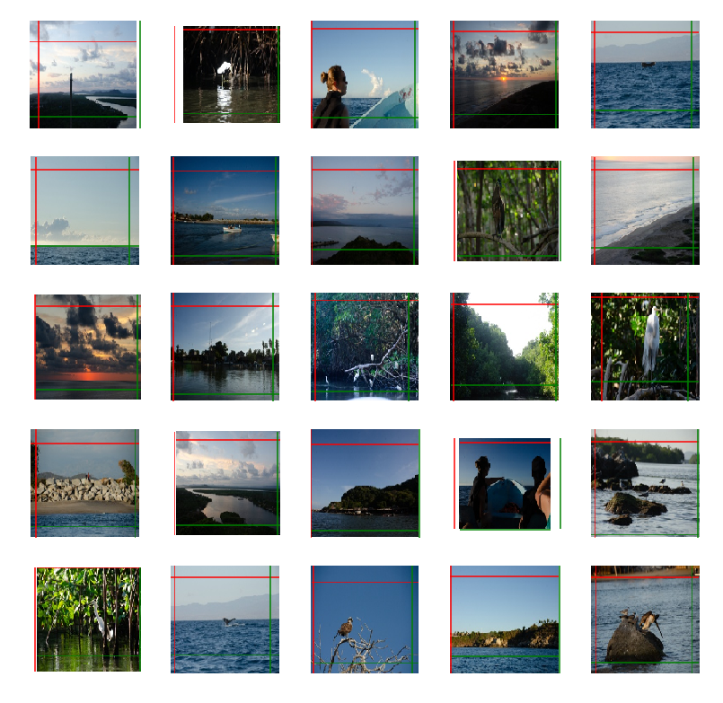  


## Deciding what to work with

I realised that I could extract information on the photo edits from the metadata added to the photo files using *Exchangeable image file format ([Exif](https://www.loc.gov/preservation/digital/formats/fdd/fdd000146.shtml))*, and use that as training data. To make matters a bit easier and the scope of the project a bit smaller, I decided to limit the edits to specifically cropping (and small rotational alignment).

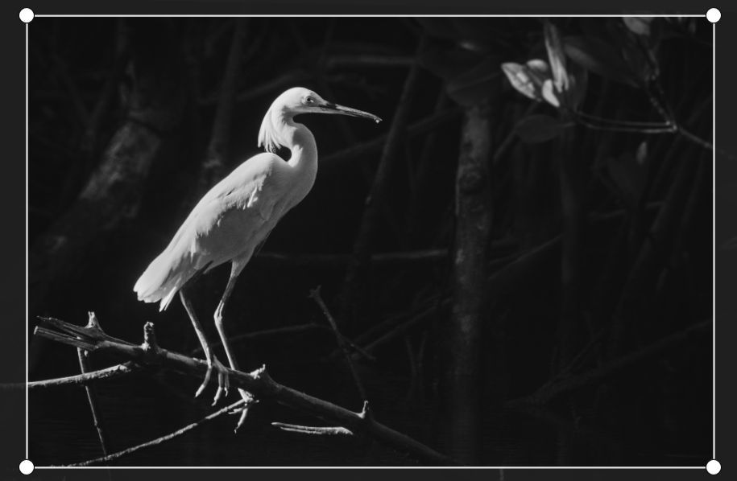  
*Hmm, how did those golden ratio rules go again?*

### Extracting the EXIF

Firstly, I wrote a small python command line tool to easily crawl my photo library for possible images, i.e. all the photos that had been cropped. I explained this in more details in the [ExifAnnotator](/projects/exifextractor) post.

Essentially, I could give the tool a path as an argument, and it would quickly find the photos which had been edited, resized them to a predefined resolution (while keeping the network training in mind) and put them into a predefined folder, as well as collected a nice json label-set for said photos. All good to go! Making my dataset was practically done! Moreover, should I need more photos, I could just run the script again for a separate folder.

Furthermore, I could expand the edits by simply referring to the *Exif* notation and defining the values I wanted to extract. Sweet.


### What is a crop?

Using the extracted data, we can see that a crop on an image is defined as four values, defining the limits from top, left, bottom and right. These limits are defined as fraction fo the image, i.e. 0-1, 0 being the leftmost and topmost edges, and 1 correspondingly the rightmost and bottommost edges. Additionally I included a value describing a rotation on the image, positive value describing a rotation clockwise, and negative anti-clockwise. 


| Metadata tag     | Example value |
| ---------------- | ------------- |
| `XMP:CropTop`    | 0.217628      |
| `XMP:CropLeft`   | 0             |
| `XMP:CropBottom` | 0.9646        |
| `XMP:CropRight`  | 1             |
| `XMP:CropAngle`  | -0.52         |

*An example of the crop defined by the metadata tags. The photo in question has been cropped in the vertical direction, and tilted slightly anti-clock-wise.*


Already we have the values which we want to predict, a vector containing five values. Excellent! Moreover, all the values are neatly within the range 0-1, and can be easily normalised to -0.5 - 0.5. to achieve zero-mean.

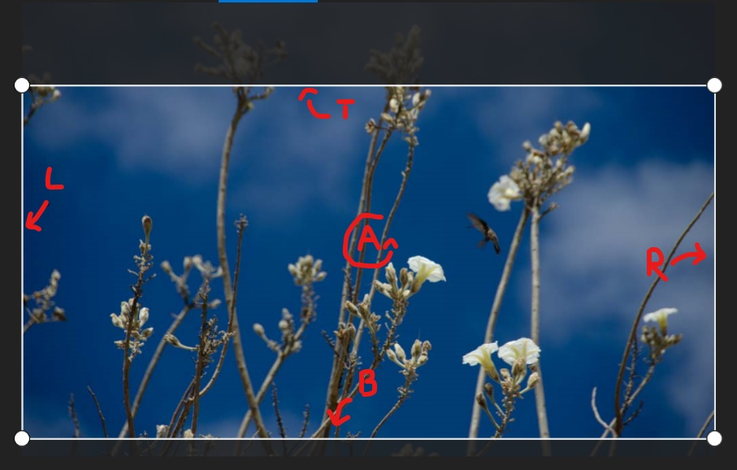  
*How do you crop your crop?*


---

## Modelling the network

Now, I really enjoy tackling problems head on. Thanks to that, I have ended up re-inventing the wheel several times over. Naturally, this is something I have learned to avoid by putting more effort in background research and utilising existing solutions. 

Nevertheless, I still find trying to solve a problem on my own extremely interesting - without any help from *"how it is done the best way"* -guides. Simply breaking the problem down and working on your own solution can help you gain knowledge and deeper understanding on the topic; knowledge that you would miss should you simply follow a "proven" solution.

Naturally, such luxuries are rare in a world that demands fast pace and high quality. Since this was not the case on this project, I jumped straight in! 


### What sort of network should I use?

Naturally, as we are processing images, I chose to use a CNN. I started with a simple one containing only a few layers, eventually leading to a fully connected layer which would output the prediction.

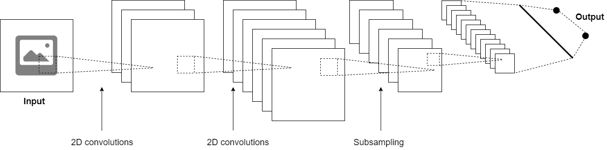  
*The very basic structure of any CNN: convolutions and subsamplings*

Along with the basic CNN building blocks, **subsampling** and **convolutional** layers, I eventually added **batch normalisation** and **dropout** layers to mitigate over-fitting. After all, I was using a relatively small set of training data. The final architecture of the network was obtained with trial and error: using **Tensorboard** as a tool to observe the performance of the network and the effect of the changes made.


### How should I evaluate this

I went with the simplest initial plan there was: using a Square Mean Error (SME) for the predictions. I wanted to see how well I could make the network run without introducing anything fancy, such as area overlap used in many object detection methods.

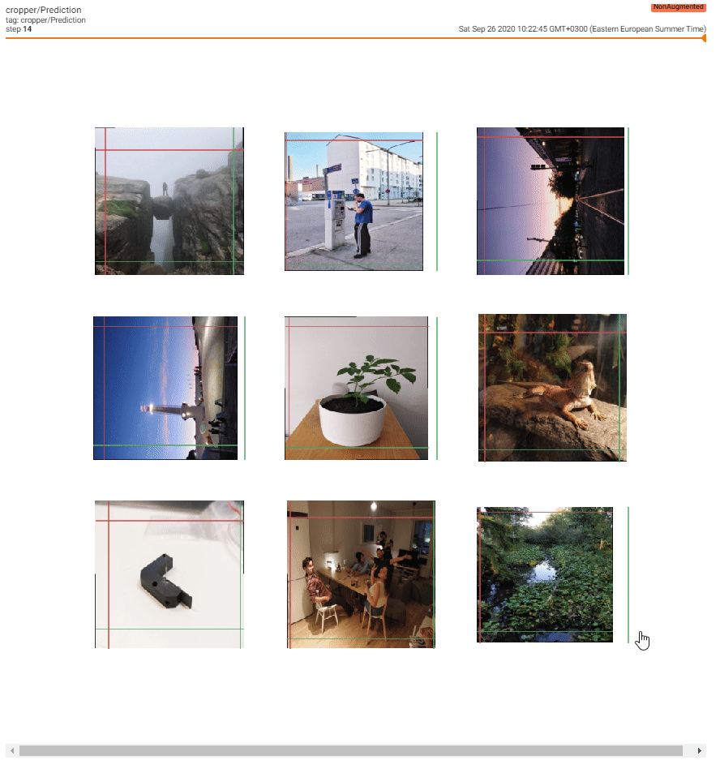  
*Crops for unseen data during training for each completed epoch, using a custom Tensorboard callback*

### How did I set it up?

I had noticed the new release of TensorFlow 2.0 and was keen on trying it out. I set up some draft **jupyter notebooks** with **TensorFlow** with **CUDA** acceleration installed, and started developing. I also whipped up a small script to visualise the progress on evaluation data in **TensorBoard**.


Then, I just started iterating.


---

## Training the network

>Now, first I need to address the issue of the network design. Considering the challenge and my lack of experience on CNN for such applications, I didn't go for any specific architecture. I started reading basic articles on image processing and modified the network accordingly. In other words, this could had been much more sophisticated and probably will make a couple sworn deep learning peeps pull a healthy handful of hair out of their head.

Next, I'll describe a few problems I ran into and how I tried to fix them.

### Problem with the limits

So, it turns out that the network thinks that there is interesting stuff happening outside the photo boundaries as well. 

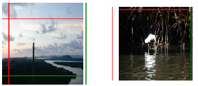  
*The CNN low-key trying to hint that you should invest in a wide-angle lens*

As technically the values for the prediction were not limited in any manner, they soon went ballistic. Initially I had hoped that the training data would be enough to limit the values but obviously not. Hence I figured there are three things that I could do:

1. Add an extra error term which would punish values beyond [-1,1]
2. Add more data

As getting more samples was a limited option, I tried to create a custom loss function which would, by some scaling, add error if the values were outside the set limits.

```py
    # Clip constraint:
    clip_constraint = BK.sum(BK.square(y_pred * BK.cast(tf.math.logical_or(
            BK.less_equal(y_pred, 0.0), BK.greater_equal(y_pred, 1.0)
    ), BK.floatx())), axis=-1)
```

*Snippet of the custom loss. `BK` is the **Keras backend**. Full module can be found in the [GitHub repository]()*

This, however did not yield any better results. Moreover, I could simply clip the resulting values to a certain limits after obtaining the result, so I did not spend too much time thinking of improvements. Maybe it would be beneficial to circle back to this problem in the future, as I find many of real world problems are innately somehow limited. 

### Left is right, up is down

Another problem arising from how I used the predictions was that the values could overlap, making the area non-existent. This, however, was a relatively rare case and seemed to go away with more training iterations. 

I wonder, though, would the use of another type of error criterion help with this?


### Overfit us

On practically every initial run, the graphs showing the accuracy and loss on familiar and unseen data fed to the network were not that satisfactory of a shape: the network was clearly overfitting the data... No wonder the photos looked so nice in the end.

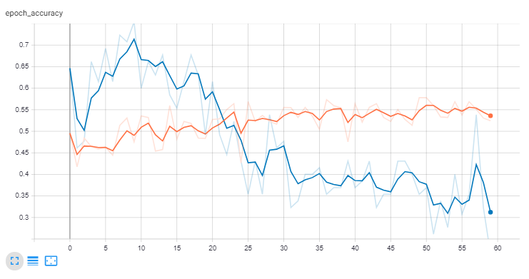  
*CNN: "If something is worth fitting, it is worth overfitting" Orange being the training data, blue the evaluation data.*

To combat this, I added some **dropout** and **batch normalisation** layers to my network, as well as made it deeper and more narrow. However, nothing beats having more data. 


### Homogenetic crops

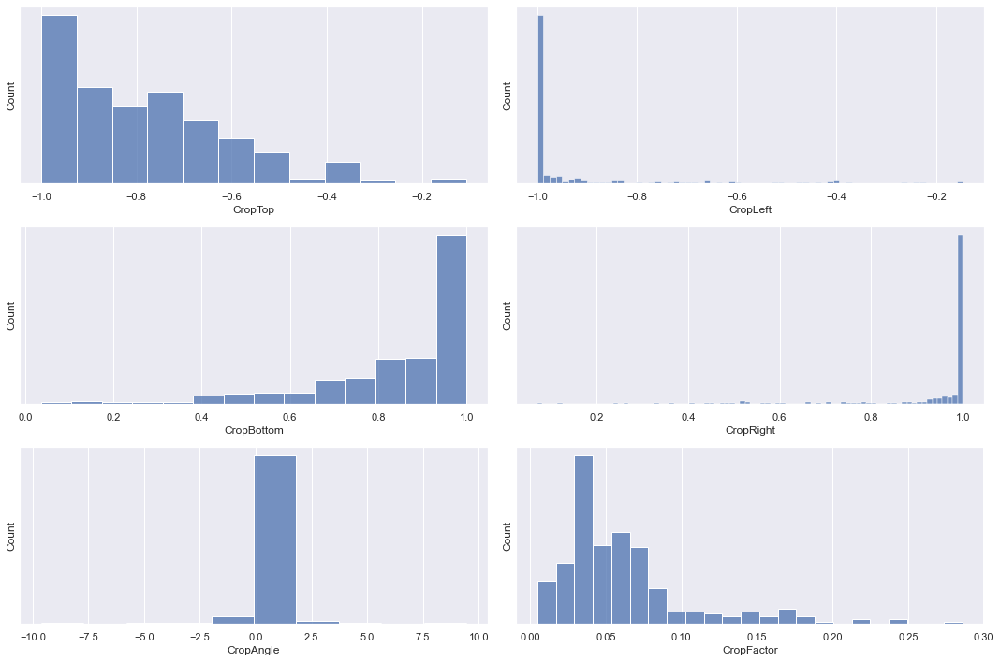  
*The crop values used in training heavily slanted statistically, causing possible probability bias to predictions.*

Additionally, the data was quite heavily slanted towards crops on the top left corner, and rather large areas instead of a clear, small areas. This was naturally the result of my cropping style, so it was also interesting to learn a bit about myself. However, some data augmentation could had been added to normalise the distributions of the training data fed to the network, such as horizontal flipping. 


### Final results

After numerous iterations on the network architecture and loss functions, I ended up with the following architecture: 

```py
Model: "sequential_1"
_________________________________________________________________
Layer (type)                 Output Shape              Param #   
=================================================================
conv2d_6 (Conv2D)            (None, 298, 298, 64)      1792      
_________________________________________________________________
max_pooling2d_4 (MaxPooling2 (None, 149, 149, 64)      0         
_________________________________________________________________
conv2d_7 (Conv2D)            (None, 147, 147, 64)      36928     
_________________________________________________________________
max_pooling2d_5 (MaxPooling2 (None, 73, 73, 64)        0         
_________________________________________________________________
dropout_2 (Dropout)          (None, 73, 73, 64)        0         
_________________________________________________________________
conv2d_8 (Conv2D)            (None, 71, 71, 64)        36928     
_________________________________________________________________
max_pooling2d_6 (MaxPooling2 (None, 35, 35, 64)        0         
_________________________________________________________________
conv2d_9 (Conv2D)            (None, 33, 33, 64)        36928     
_________________________________________________________________
max_pooling2d_7 (MaxPooling2 (None, 16, 16, 64)        0         
_________________________________________________________________
dropout_3 (Dropout)          (None, 16, 16, 64)        0         
_________________________________________________________________
conv2d_10 (Conv2D)           (None, 14, 14, 64)        36928     
_________________________________________________________________
conv2d_11 (Conv2D)           (None, 14, 14, 64)        4160      
_________________________________________________________________
flatten_1 (Flatten)          (None, 12544)             0         
_________________________________________________________________
dense_3 (Dense)              (None, 64)                802880    
_________________________________________________________________
dense_4 (Dense)              (None, 32)                2080      
_________________________________________________________________
dense_5 (Dense)              (None, 5)                 165       
=================================================================
Total params: 958,789
Trainable params: 958,789
Non-trainable params: 0
_________________________________________________________________
```

*The final architecture of the network*

For loss, I found the basic SME to work best. Generally, the resulting crops seemed sensible, and more importantly, deterministic based on the input image. I was satisfied, considering my skills and the time I had allocated for this project in between my studying and work. 

However, as one can obviously tell, the resulting crops are rather, well, open for interpretation: had the network really learnt to crop the images, or simply pseudo-randomly sprouted predictions, using the input image as a seed and the training crop distributions as the value pool? Especially, the values seemingly restricted to [|0.6, 1|], practically any random crop could be interpreted by a user as a "sensible crop", especially if the image was already at least somehow sensibly cropped to begin with.

It would be indeed interesting to have a comparison of the different methods: one image, cropped by a human, a trained CNN and a random generator with sensible limits. Would a person be able to tell a difference? What would it prefer? Could they be improved? Could any of these systems learn from each other? Is there something to be learnt from the expression "beauty is in th eye of the beholder?" 


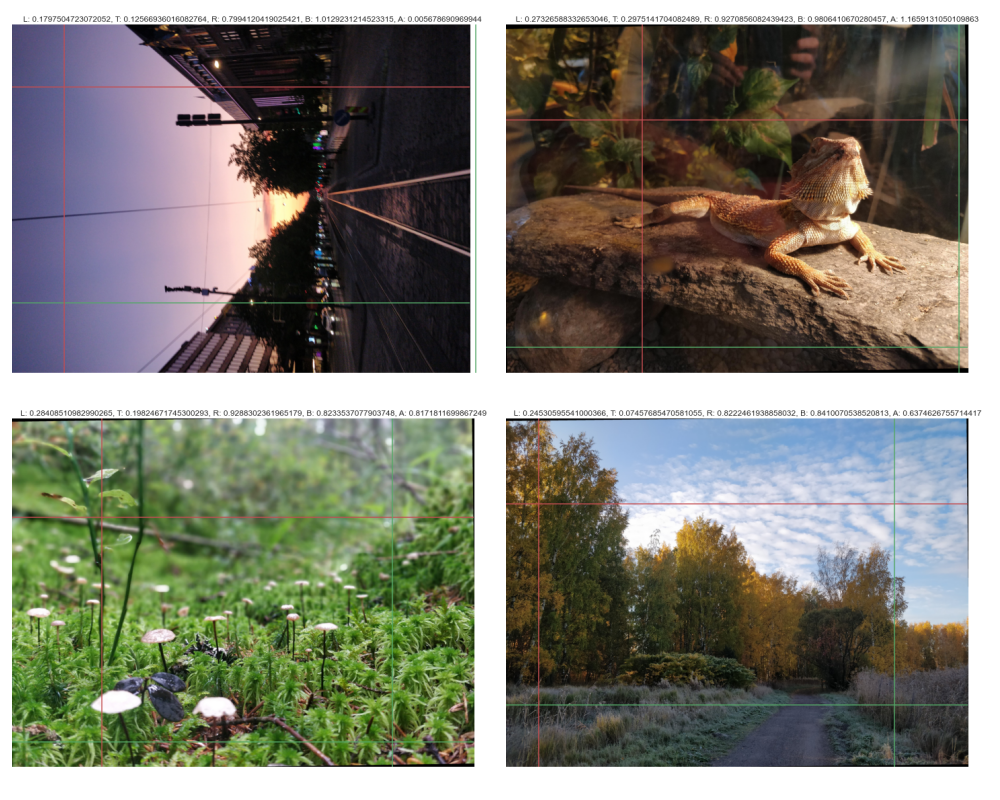 
*Some example predictions.*

---

## Time to go public

Naturally I wanted to show off with this cool little toy I had created. I did not want to drag my laptop around or record hours on my screen - nah, I'd rather whip up a simple tool to let people play around with the network. Sharing is caring after all, right?

I was also interested in the at the time recent [`TensorFlow.js` (TensorFlow JavaScript)](https://www.tensorflow.org/js) library. Apparently with this, it would be rather straightforward to add your networks to web applications.

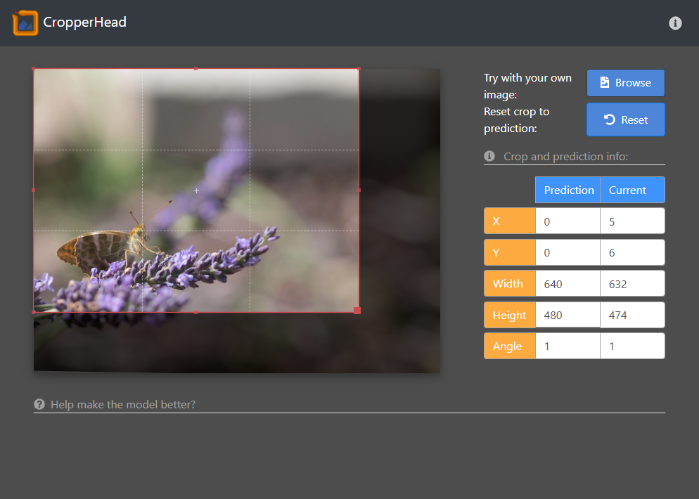
*The UI for the CropperHead "Service"*

By following the few tutorials available on `tfjs` website, I managed to pull together a rather decent looking website. Simple enough, no extra shinies and included all the necessary funcitonality: the user could select a photo from their computer to be analysed and see the estimated values. I used [`cropper.js](https://fengyuanchen.github.io/cropperjs/) for displaying the estimated crop on the web application. However, as the `cropper.js` had such nice functionality for cropping the photo, I was inspired...


## Gimme more data!

As quite obvious from the text above, the implementation of the network was not by any means optimal. On top of the shortcomings I already listed, one major flaw also existed: lack of training data. Despite my efforts of crawling through the photo library I accumulated over the years, as well as trying to crowd-source data collection to my friends who also enjoy photography, I only managed to collate around 300 photos. Considering the problem, I would estimate to need around ten times more... [LINKS TO ARGUMENT] So, how to get it?

### Not happy? Then show me how!

The obvious solution to collect the data in form and without constraints, would be to utilise the UI! As people would be able to add their own photos, and `cropper.js` supported cropping on the UI, it would be quite convenient to combine these two for a pipeline to collect the much needed data. A simple block of text assuring our benevolent means and needs, along with a hint of instructions, and a coule of buttons later, the UI was ready to process the preferred crops of the users!

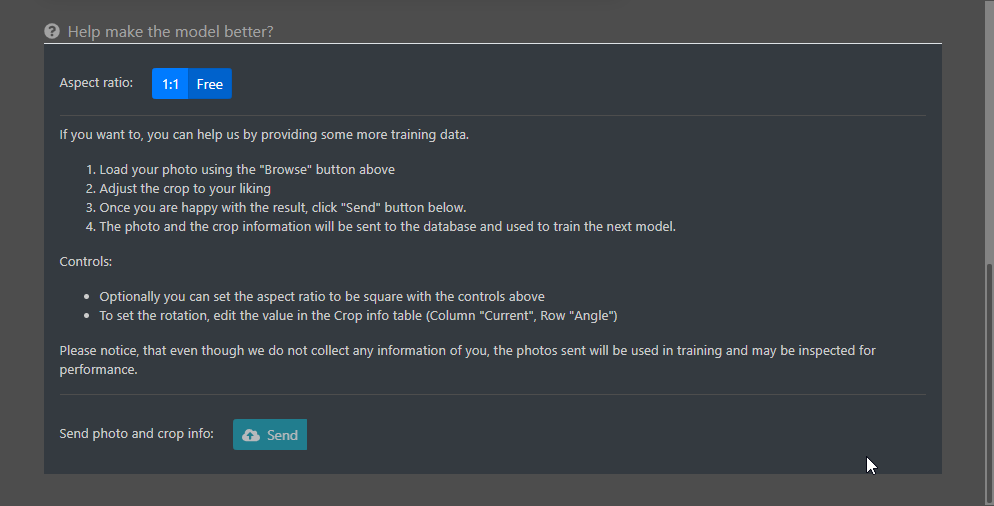
*How to tell me how to do my job*

### Where are the data go to?

The UI side was fixed, bu what about the server side? How, where and when were the photos and labels processed? As I had some previous experience using `mongoDB`, `AWS` and microservices, I implemented a (not so simple) scalable data collection service - [`DataLibrarian`](/projects/datalibrarian)! With it, I could easily set up a service which would nicely route the photos to a *AWS S3* bucket, the lables to *mongoDB* and keep a record of how they were paired. YOu can read more about the project in its dedicated project description.

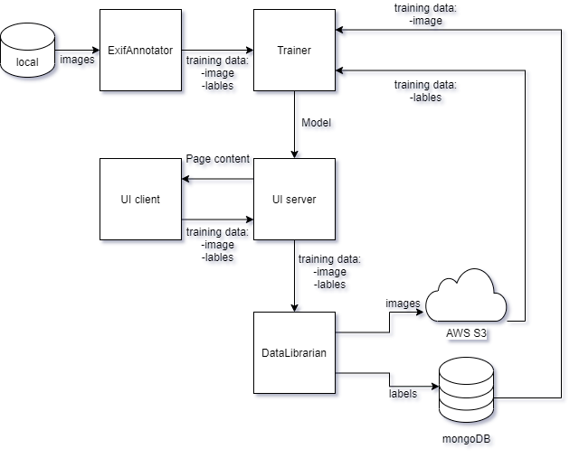
*Simplified view of the entire project architecture*


## All is well that ends well

So, with the few extra hours I had for myself after work, I had managed to effectively collect training data by extracting crop information from **Exif**, create and train a **Convolutional Neural Network** to crop (and slightly rotate) photos automatically, design and publish a web application where users all around the world could try out the performance of the network, along with a method and infrastructure for collecting more training data to further improve my model! 

### What could I improve?

I am rather happy with the overall result. All of the individual block can naturally be improved (quite a lot) but also the entire approach could be different. For example, the following might be interesting changes:

- Using object identification to analyse what to include to the crop
- Using a predefined crop factor
- Using a different loss, such as Intersection over Union (IoU)

 Nevertheless, the entire project served its purpose as an entertaining way to try and learn new. Implementing such a solution from start to finish hopefully helps me to extensively learn and communicate with appropriate professionals, and concentrate on more pressing issues. Such wonderful time!