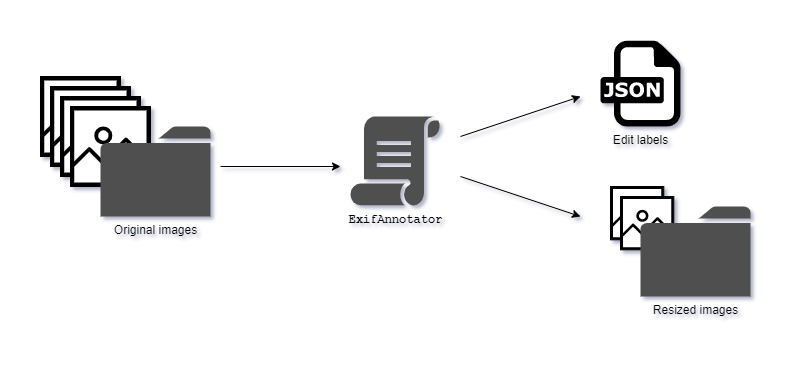

>Among other things, I like taking photos in my spare time. Consequently, use a large amount of time not in some editing software trying to perfect the shots I have managed to scavenge. A lot of the adjustments and workflows with the photos are usually quite standard: crop, tilt, adjust color, adjust highlights, contrast, brightness etc.. So, if I, a human, can judge the necessary adjustments by looking at the photo, could a computer do some of them for me?
>
>For this I worked on the [CropperHead](/projects/cropperhead) project. However, to get the training data for the convolutional neural network used in the project, I had to extract some edit information from my library of photos. Hence, this little script here.


## Wherein does the information lie?

So, I primarily use Adobe Lightroom for my edits which, like many other proper photo editing softwares, edits the photos non-destructively. Therefore the information of the edits applied had to be saved somewhere. But where?

After a bit of digging around, I found out that Lightroom, quite cleverly, [stores](https://helpx.adobe.com/lightroom-classic/help/metadata-basics-actions.html) the information in the metadata attached to the in **Exchangeable image file format** (Exif) - or simply photo files in this case. More information could be found. The metadata in the photos practically includes a dictionary of the edits, along with other information of the image, which are then applied to the photo by the photo editing software. 


```json
"EXIF:ImageWidth": 4948,
"EXIF:ImageHeight": 3280,
"XMP:CropTop": 0.217628,
"XMP:CropLeft": 0,
"XMP:CropBottom": 1,
"XMP:CropRight": 1,
"XMP:CropAngle": 0,
"EXIF:Orientation": 1,
"EXIF:OriginalRawFileName": null,
"File:FileName": "_ORN5639.DNG",
"XMP:RawFileName": "_ORN5639.DNG",

```

*Some good EXIF data, straight from the beginning of a jpeg file.*

Luckily, there already exist convenient tools to extract this metadata from Exif files. I just had to incorporate them into my workforce.

---

## The Extraction!

So, I needed a way to extract this information. Moreover, I wanted to gather all available information from all of the photos that I had edited over the years. (Luckily I had just recently reinstalled my OS, and had a significantly smaller library to test around than previously).

To access the EXIF data, I found [EXIFTool](https://www.exiftool.org), with a ready made python wrapper for it, [PyExifTool](https://smarnach.github.io/pyexiftool/), and presto, I could add my scripts on top for the desired functionality! However, I had to use a special fork of the PyExifTool wrapper to fix a bug present in the official release.

Considering the possibility of other people using the script I eventually made, this setup that requires the user to install the tool along with cloning the repository is not the most optimal solution. Small inconvenience for the user, but nothing that would be too much to ask.


### Not gonna need all those pixels

Keeping the training of the CNN I had planned in mind, I decided to add some functionality to do a little preprocessing at the same time - namely resizing. As the cropping information, which I was mainly after, was defined as percentages of the image, and not pixels, I could resize them as I saw fit. Now, the tool would spit out a `.json` file containing the extracted edit information, as well as a folder of photos resized to fit certain dimensions and in congruent file type.


*The script would scan the images in afolder for ones that had been edited the way we were interested, extract the values and resize the images as a copy to another folder.*

### Con Configuration rationing!

As different photo editing softwares might use different sets of tags to store the edits into the metadata, the tags to be extracted had to be selected carefully and should not be hard-coded. I added a configurations file for an easier access to different options the extractor would use. By editing the `json` at the root of the tool folder, the user could define the following options:

- `EXTRACTABLES`: the EXIF information that will be exported should they be available for a photo, along with a default value if it does not have any defined.
- `SETTINGS`: Different settings for the tool, including the destination folder, dimensions for resized images and compression quality.
- `ANNOTATIONS_FILE`: file where the extracted information will be stored as csv.


An example configuration file would look like this:

```json
{
    "EXTRACTABLES": {
        "ImageWidth": ["EXIF:ImageWidth", null],
        "ImageHeight": ["EXIF:ImageHeight", null],
        "CropTop": ["XMP:CropTop", 0],
        "CropLeft": ["XMP:CropLeft", 0],
        "CropBottom": ["XMP:CropBottom", 1],
        "CropRight": ["XMP:CropRight", 1],
        "CropAngle": ["XMP:CropAngle", 0],
        "Orientation": ["EXIF:Orientation", 1],
        "Original": ["EXIF:OriginalRawFileName ", null],
        "ExifFileName": ["File:FileName", null],
        "RawFileName": ["XMP:RawFileName", null]
    },

    "SETTINGS": {
        "dest_dir": "resized/",
        "dim_max": 640,
        "height": 640,
        "width": 320,
        "quality": 80
    },

    "ANNOTATIONS_FILE": "annotations.json"
}
```

*An example configuration file for the command line tool*

---

## From one dummy, to many dummies

So, how to extract the same information from a bunch of files in several folders? What if I needed more data and had to ask help from friends, who might not be as familiar with programming? I had to streamline things a bit...

I ended up using the magnificent [Fire](https://github.com/google/python-fire) library to wrap my custom library into a convenient command line tool! From now on, one could, after installation, simply run: 

```shell{promptUser: or}{promptHost: dev.localhost}
python annotator.py ./images
```

to analyse a single directory. Simple, convenient and ready to be rolled out! I was finally ready to get some training data for my hungry networks!


