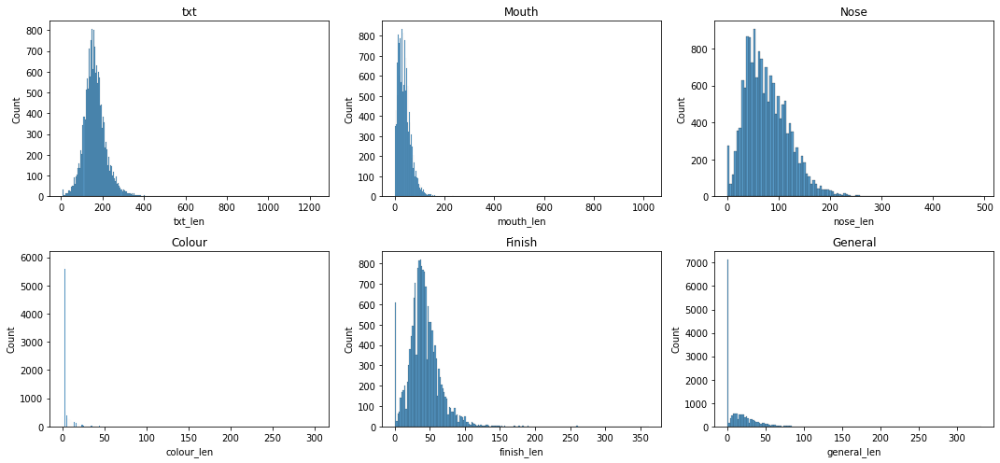
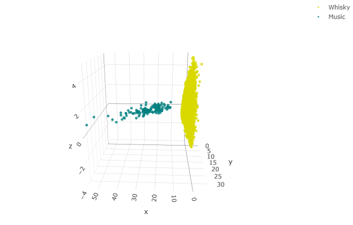

>This one evening, during bone chilling winter, me and a few of my buddies were warming up with some good quality scotch and listening to some music, everyone playing their favourites songs. Once it was my turn to select a song, I was stumped as nothing came to my mind. Instead, I started to wonder; would it be possible to train a neural network to do this difficult decision for me...

So, I started drafting for a tool which would recommend soundtrack for any whisky you would like. To evaluate the resulting system, I defined the following goals:

1. Support an extensive list of whiskys from several different distilleries
2. Obtain "meaningful"/"logical" song as a recommendation
3. Different whiskys should get different recommendations
4. Similar whiskys should get similar music/songs

---

## Whisky
For the whisky, I crawled the www.whiskyfun.com website for over 16000 reviews for whiskys (and some other spirits). Each review was split into subcategories of "general", "colour", "nose", "mouth", and "finish". Moreover, the reviews include some additional information, such as the alcohol volume, bottle number, cask number and score for the review.

### Split into sentences, distribute according to keywords
Some of the reviews, however, are not as clearly divided. Some have some mixed content as well. To get a better representation of teh review on every sense, it made more sense to split the entire review by full stops and then divide the sentences to the three senses. As a sentence could describe multiple senses, it could therefore be included in multiple sense classes.

> "Colour: amber with reddish hues. Nose: starts punchier than the OB's but also much more sherried, even if what's "behind" it is very similar it seems. Coffee fudge, hot praline, sultanas, prunes, hints of wine brandy (more armagnac in this case) plus something coastal, kelp, seashells... A little peat smoke as well. But again, other than that, we're globally close to the OB's. Mouth: same differences as on the nose, except that the "sherryness" is even bigger. Good vinosity - even if maybe a bit extreme here - to the point where one could well think that this is truly armagnac when tasting blind. Loads of prunes and good pepper. Finish: very long, with this big dry sherry overwhelming the rest. Excellent but maybe just a tad "too much". SGP:443 - 89 points"

Moreover, the beginning of the review usually is a general description of the whisky, it will be used as a sense as well. For example:

>"This one was made by the same owners as Littlemill's, yet I'm not 100% sure it was the Dunglass single malt, i.e. the experimental malt they made in the seventies, together with the peated Dumbuck. Colour: white wine. Nose: light and very grainy, as expected. Gets quite grassy (hay, heavily sugared iced tea). Dried flowers, caramel, hints of praline. Mouth: aromatically weak, sweetish; Hints of lavender ice cream, pear juice, apple juice. Rather long, and slightly peppery finish. Not so bad, in the same vein as the Glen Grant 5yo. 72 points"

Basic algorithm to break the review into senses:
1. Split the review by full stops ('.')
2. Iterate over them in order
3. Until one of the keywords ('mouth:', 'nose:', 'colour:', 'finish:') is met, add sentence to 'general'
4. When a keyword is met, add that sentence, and any following, to that category
5. If multiple keywords are found in the sentence, add them to both categories
    - This does not change the category
6. When the points sentence is met, stop

With the algorithm, we could extract the needed info. Take, for example, the latter of the two quotes:

```json
{
    "mouth": [
        "Mouth: aromatically weak, sweetish; Hints of lavender ice cream, pear juice, apple juice",
        "Rather long, and slightly peppery finish",
        "Not so bad, in the same vein as the Glen Grant 5yo",
        "72 points\""
    ],
    "nose": [
        "Nose: light and very grainy, as expected",
        "Gets quite grassy (hay, heavily sugared iced tea)",
        "Dried flowers, caramel, hints of praline"
    ],
    "colour": [
        "Colour: white wine"
    ],
    "finish": [
        "Rather long, and slightly peppery finish"
    ],
    "general": [
        "\"This one was made by the same owners as Littlemill's, yet I'm not 100% sure it was the Dunglass single malt, i",
        "e",
        "the experimental malt they made in the seventies, together with the peated Dumbuck"
    ]
}
```

### The features of a whisky connoisseur!

  
*All of the feature distributions are relatively slanted, and especially the features extracted from the "general" field are mostly empty, as expected*

## Music
The music data comes from the "Million song dataset" and the connected "MusiXMatch" lyrics BoW data, as the initial thought was to use the lyrics as a way to connect the music and whisky together. 

This approach however, would completely ignore the musical tone of the songs, hence being more of a "whisky to poems" recommender. To include the musical elements to the system as well, additional data, such as features like ones of EchoNest, should be used as well. 

### Stemming and filtering keywords

As I planned to use the lyrics for the million song dataset for the training, I decided to use the same stemming and word bagging as they had used to maximise the matching. The algorithm used is available at: https://github.com/tbertinmahieux/MSongsDB/blob/master/Tasks_Demos/Lyrics/lyrics_to_bow.py

To create a BoW representation of all the reviews, I did the following:

- Iterate the reviews:
    1. Create a BoW from the review
    2. Add possible new words to the word list
    3. Add a sparse vector of words within the appended list of words
    
---

## Connection
The inherent problem is, how to make a meaningful connection between two innately different, abstract objects. How do people perceive a connection of "this would go well with that"? Is it more about the related characteristics, semantic similarities, or connection to some other, third party.

I recently had worked on a project which utilized the word2vec and doc2vec tools. Realising, that if I could somehow map the documents of whisky review to music features, I could simply compare the similarity of a whisky to those of the songs, and select the best match via some metric, such as cosine similarity.

It was time to get crunching...

---

## First model!
Whisky2Music was tried previously. The technique back then was to utilise the assumption that all words have a general meaning in communication: if I could analyse the entire communication of human history, I could learn the relativeness of words in a large scale. This however, removes all the nuance and alternative relations arising from context of the communication. For example, the word "Apple" might mean the fruit or the company in different contexts.

In the previous model, I used a pre-trained word2vec model, trained with news articles (provided by Google). Then I would map the music into this space by using the names of the EchoNest features as the descriptive vectors, and similarly, extract the most meaningful words for a whisky using TF-IDF and used the vector sum of those words as a mapping into the word space. Then, I could simply use a similarity measure (cosine similarity in that case) to see, which songs were closest to which whiskys.

This had two problems: the possible space for the music was far more constrained that that of the whiskys, and the whisky and music seemed to map relatively far from each other. This lead to the effect of having practically two separate clouds: the music and the whisky: there were songs that got recommended to all of the whiskys. I.e., each whisky did not get a different song as a recommendation.

  
*The dimensional issue with whisky and music: every whisky would map to a single song with simple similarity metrics*


## But maybe I can do better!
To improve this, I try the following:
- Use lyrics for the music as well
- More versatile set of words for the whiskys
- Similar word clouds for both
- Better ensemble for the object vector/mapping than vector sum


> The vector space representations, such as word2vec, are extremely intriguing: the spatial location of a word relative to others describes their relationship, which would imply, that there would be a space between the words for new, more nuanced words. And not only one, two or few, but infinitely many words, that would describe that specific spot in the vector space far more precisely!

---
## More considerations on Word2Vec
Word2Vec learns its models by having a pool of words that occur near each other. The model can be thought in either CBOW or skip-gram manner:

>**CBOW:** Learn to predict which word would be in the company of a bunch of other words (continue the set)
>
>**skip-gram:** Learn to predict in which bunch of words a specific word would belong to.

Perhaps this could be the basis to create our my model!
- Map the words into a vector space (create a VSP) of dimension D
    - Each word has now a vector representation, in general world context
- Select N/M meaningful words/features (EchoNest/TF-IDF?) 
    - Each whisky and music can now be described as NxD or MxD vector
- Generate a model to create a mapping between these vector representations
    - Similar whiskys should get similar songs
        - Closer to each other
    - Different whiskys should get different songs
        - More distant from each other
        
---

Using this knowledge, we can interpret the different whiskys and songs as *An ensemble of finite number of vectors within a finite dimensional vector space*
- An object with area and volume
- A shape
- A point (e.g. Center of gravity)


Notes:
- Order of the vectors within the VSP matters 
    - (how to order the words once selected?)
    - BOW presentation suboptimal

## Second try?
I have been recently updating the project, trying to implement the aforementioned improvements but the project is still ongoing. The results will be updated here once it progresses so stay tuned!