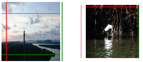

>This'll be some nice little post about a neural network.
>
>I like to use my free time periodically behind the camera. Capturing moments, entities, phenomenons and ideas is extremely rewarding when you get that perfect shot. What isn't rewarding, however, is the time spent on post-processing the images - crawling through the numerous shots you took just in case, and trying to decide the perfect ensemble for a ashot. 
>
>This, along with my innate laziness and curiosity, inspired me to create a small naural network to help me with this process. 

## Deciding what to work with
I realised, that I could extract the information on the photo edits from metadata files (EXIF, and use that as training data. To make matters a bit easier and hence scope the project a bit, I decided to limit the edits to specifically cropping (and small rotational alignment).

### EXIF extractor
Firstly, I wrote a small python command line tool to easily scrape my photo library for possible images, i.e. all the photos that had been cropped. This on its own is explained in more detail in the `ExifAnnotator` post.

In it's simplicity, I could give the tool a path as an argument, and it would nicely find the photos which had been edited, resized them to a predefined resolution (already keeping the training in mind) and put them into a predefined folder. All good to go! Making my dataset was practically done! Moreover, shuold I need more photos, I could just run the script again for a separate folder.

Also, I could expand the edits by simply referring to the EXIF notation and defining the values I wanted to extract. Sweet.

## Modelling the network
Now, I really enjoy tackling problems head on and because of that, I have ended up re-inventing the wheel several times over. Naturally, this is something I have learned to avoid by putting more effort to background research and utilising already implemented solutions. 

However, I also find it extremely interesting just trying to solve a problem on my own - without any help from "how it is done the best way" -guides. Simply breaking the problem down and working on your own solution can help you gain knowledge and deeper understanding on the topic that you would amiss shuold you simply follow a solution shown to work.

Naturally, such luxuries are rare in world which demands high pace and good quality results. Nevertheless, this was not the acse on this project, so I jumped straight on! 

(This section is about my trials and errors for a not-so-perfect solution)

### What is a crop?
Using the EXIF data, we can see that a crop on an image is defined as four values, defining the limits from top, left, bottom and right. These limits are defined as fraction fo the image, i.e. 0-1, 0 being the leftmost and topmost edges, and 1 correspondingly the rightmost and bottommost edges. Additionally I included a value describing a rotation on the image, positive value describing a rotation clockwise. and negative anti-clockwise. 

Already we have our values which we want to predict, a five value vector. Yay! Moreover, all the values are neatly within range 0-1, and can be easily normalised to -0.5 - 0.5. to be zero-mean.

### What sort of network should I use?
Naturally, as we are processing images, I chose to use a CNN. I started out with a simple one with only a few layers, eventually leading to a fully connected layer which would output the prediction.

### How should I evaluate this
I went with the simplest initial plan there was: simply using a error term for the predictions. I wanted to see how well I could make the network run without introducing anything fancier, such as area overlap used in many obhject detection methods.

### How did I set it up?
I had noticed the new release of TensorFlow 2.0 and was keen to try it out. Hence, I set up some drafty jupyter notebooks with TensorFlow with CUDA acceleration installed, and started developing. I also whipped up a small script to visualise the progress on evaluation data in TensorBoard.

Then, I just started iterating.

## Training the network

*As you can see, this is pretty cool!*

>Now, firstly I need to address the issue of the network design. Considering the challenge and my lack of experience on CNN for such applications, I didn't go for any specific architecture. I simply kept on reading a few basic articles on image processing and modified the network accordingly. In other words, this could had been much more sophisticated and probably will make a couple sworn deep learning peeps tore a good bunch of hair out of their head.

Next, I'll describe a few problems I ran into and how I tried to fix them.

### Problem with the limits
So, turns out that the network thinks that there is interesting stuff happening outside the photo boundaries as well.

*The CNN low-key trying to hint that you should invest into a wide-angle lens*

#### Out-of-bounds
As technically the values for the prediction were not limited in any manner, they soon went ballistic. Initially I had hoped that the trainng data would be enough to limit the values but obviously not. Hence I figured out there would be three things I could do:

1. Add an extra error term which would punish values beyond 0-1
2. Add more data

Initially, of course I fixed the mistake of the predictions not being zero mean.

#### Left is right, up is down
Another problem arising from how I used the predicitons was that the values could overlap, making the area non-existent. This, however, was a realtively rare case and seemed to go away with more traning iterations.

I wonder, though, would the use of another type of error criterion help with this?
