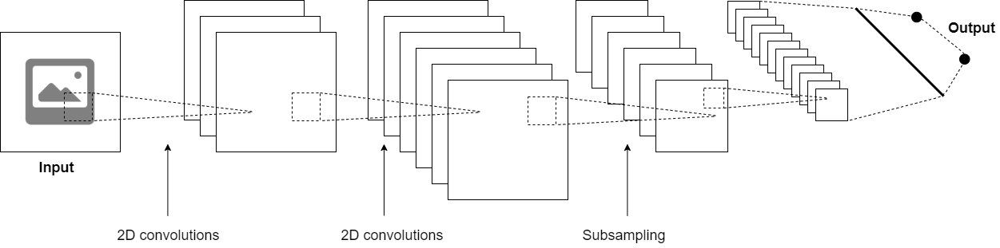
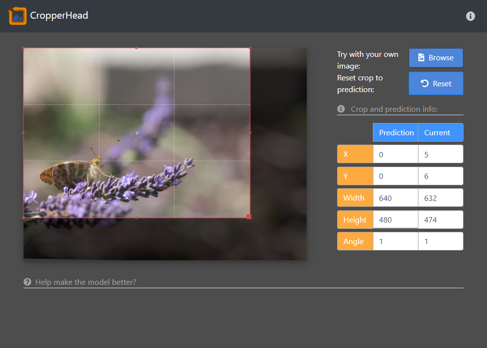
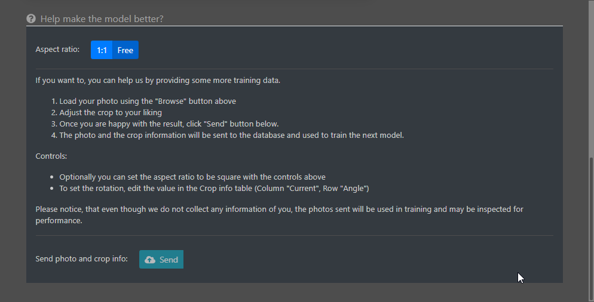

>This'll be some nice little post about a neural network.
>
>I like to use my free time periodically behind the camera. Capturing moments, entities, phenomenons and ideas is extremely rewarding when you get that perfect shot. What isn't rewarding, however, is the time spent on post-processing the images - crawling through the numerous shots you took just in case, and trying to decide the perfect ensemble for a ashot. 
>
>This, along with my innate laziness and curiosity, inspired me to create a small naural network to help me with this process. 

## Deciding what to work with
I realised, that I could extract the information on the photo edits from metadata files (EXIF, and use that as training data. To make matters a bit easier and hence scope the project a bit, I decided to limit the edits to specifically cropping (and small rotational alignment).

### EXIF extractor
Firstly, I wrote a small python command line tool to easily scrape my photo library for possible images, i.e. all the photos that had been cropped. This on its own is explained in more detail in the `ExifAnnotator` post.

In it's simplicity, I could give the tool a path as an argument, and it would nicely find the photos which had been edited, resized them to a predefined resolution (already keeping the training in mind) and put them into a predefined folder. All good to go! Making my dataset was practically done! Moreover, shuold I need more photos, I could just run the script again for a separate folder.

Also, I could expand the edits by simply referring to the EXIF notation and defining the values I wanted to extract. Sweet.

## Modelling the network
Now, I really enjoy tackling problems head on and because of that, I have ended up re-inventing the wheel several times over. Naturally, this is something I have learned to avoid by putting more effort to background research and utilising already implemented solutions. 

However, I also find it extremely interesting just trying to solve a problem on my own - without any help from *"how it is done the best way"* -guides. Simply breaking the problem down and working on your own solution can help you gain knowledge and deeper understanding on the topic that you would amiss should you simply follow a solution shown to work.

Naturally, such luxuries are rare in world which demands high pace and good quality results. Nevertheless, this was not the acse on this project, so I jumped straight on! 

(This section is about my trials and errors for a not-so-perfect solution)

### What is a crop?
Using the EXIF data, we can see that a crop on an image is defined as four values, defining the limits from top, left, bottom and right. These limits are defined as fraction fo the image, i.e. 0-1, 0 being the leftmost and topmost edges, and 1 correspondingly the rightmost and bottommost edges. Additionally I included a value describing a rotation on the image, positive value describing a rotation clockwise. and negative anti-clockwise. 

Already we have our values which we want to predict, a five value vector. Yay! Moreover, all the values are neatly within range 0-1, and can be easily normalised to -0.5 - 0.5. to be zero-mean.

### What sort of network should I use?
Naturally, as we are processing images, I chose to use a CNN. I started out with a simple one with only a few layers, eventually leading to a fully connected layer which would output the prediction.

*The very basic structure of any CNN: convolutions and subsamplings*

Along with the basic CNN building blocks, **subsampling** and **convolutional** layers, I also used **batch normalisation** and **dropout** layers to mitigate overfitting. After all, I was using a relatively samll set of training data. The final architecture of the network was obtained with trial and error: using Tensorboard as a tool to observe the performance of the network and the effect of teh changes made.

### How should I evaluate this
I went with the simplest initial plan there was: simply using a error term for the predictions. I wanted to see how well I could make the network run without introducing anything fancier, such as area overlap used in many obhject detection methods.

### How did I set it up?
I had noticed the new release of TensorFlow 2.0 and was keen to try it out. Hence, I set up some drafty jupyter notebooks with TensorFlow with CUDA acceleration installed, and started developing. I also whipped up a small script to visualise the progress on evaluation data in TensorBoard.

Then, I just started iterating.

## Training the network

*As you can see, this is pretty cool!*

>Now, firstly I need to address the issue of the network design. Considering the challenge and my lack of experience on CNN for such applications, I didn't go for any specific architecture. I simply kept on reading a few basic articles on image processing and modified the network accordingly. In other words, this could had been much more sophisticated and probably will make a couple sworn deep learning peeps tore a good bunch of hair out of their head.

Next, I'll describe a few problems I ran into and how I tried to fix them.

### Problem with the limits
So, turns out that the network thinks that there is interesting stuff happening outside the photo boundaries as well.

*The CNN low-key trying to hint that you should invest into a wide-angle lens*

#### Out-of-bounds
As technically the values for the prediction were not limited in any manner, they soon went ballistic. Initially I had hoped that the trainng data would be enough to limit the values but obviously not. Hence I figured out there would be three things I could do:

1. Add an extra error term which would punish values beyond 0-1
2. Add more data

Initially, of course I fixed the mistake of the predictions not being zero mean.

#### Left is right, up is down
Another problem arising from how I used the predicitons was that the values could overlap, making the area non-existent. This, however, was a realtively rare case and seemed to go away with more traning iterations.

I wonder, though, would the use of another type of error criterion help with this?

## Time to go public
Naturally I wanted to show off with this cool little toy I had created. I did not want to drag my laptop around or record hours on my screen - nah, I'd rather whip up a simple tool to let people play around with the network. Shareing is caring after all, right?

I was also interested in the at the time recent [`TensorFlow.js` (TensorFlow JavaScript)](https://www.tensorflow.org/js) library. Apparently with this, it would be rather straightforward to add your networks to web applications.

*The UI for the CropperHead "Service"*

By following the few tutorials available on `tfjs` website, I managed to pull together a rather decent looking website. Simple enough, no extra shinies and included all the necessary funcitonality: the user could select a photo from their computer to be analysed and see the estimated values. I used [`cropper.js](https://fengyuanchen.github.io/cropperjs/) for displaying the estimated crop on the web application. However, as the `cropper.js` had such nice functionality for cropping the photo, I was inspired...

## Gimme more data!
As quite obvious from the text above, the implementation of the network was not by any means optimal. On top of th eshortcomings I already listed, one major flaw existed also: lack of training data. Even despite my efforts of crawling through my photo library accumulated over the years, as well as trying to crowdsource data collection to my frineds who also enjoy photography, I only amnaged to collate around 300 photos. Considering the problem, I would estimate to need around ten times more... [LINKS TO ARGUMENT] So, how to get it?

### Not happy? Then show me how!
The obvious solution to collect the data in form and without constraints, would be to utilise the UI! As people would be able to add their own photos, and `cropper.js` supported cropping on the UI, it would be quite convenient to combine these two for a pipeline to collect the much needed data. A simple block of text assuring our benevolent means and needs, along with a hint of instructions, and a coule of buttons later, the UI was ready to process the preferred crops of the users!

*How to tell me how to do my job*

### Where are the data go to?
The UI side was fixed, bu what about the server side? How, where and when were the photos and labels to be processed? As I had some previous experience using `mongoDB`, `AWS` and microservices, I implemented a (not so simple) scalable data collection service - [`DataLibrarian`](/projects/datalibrarian)! With it, I could easily set up a service which would nicely route the photos to a *AWS S3* bucket, the lables to *mongoDB* and keep a record of how they were paired. YOu can read more about the project in it's dedicated project description.

## All is well that ends well
So, with the few extra hours I had for myself after work, I had managed to effectively collect training data by extracting EXIF information from photos, create and train a Convolutional Neural Network to crop (and slightly rotate) photos automatically, design and publish a web application where users all around the world could try out the performance of the network, along with a method and infrastructure for colelcting more training data to further improve my model! 

I am rather happy with the overall result. All of the individual block can naturally be improved (quite a lot), but the entire project served its purpose as an entertaining way to try and learn new. Implementing such a solution from start to finish hopefully helps me to extensively learn and communicate with appropriate professionals, and concentrate on more pressing issues. Such wonderful time!