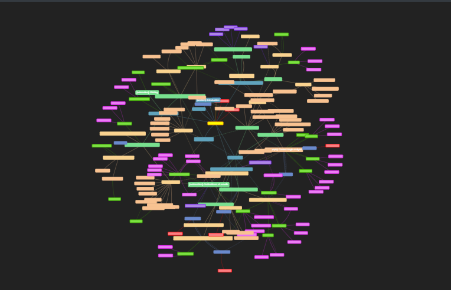

>Writing your thesis. Ah what a task! Like probably many of us, I also encountered a point where comprehending the entire scope of the thesis was overflowing to every umaginable direction. I wanted - no, needed - a way to visualise what I was doing. Being as lazy as I am, I did not want to have a mindmap that I had to manually update every time I made changes to the thesis structure. It had to be automated.

## A map for your thoughts
I started playing around with the excellent mindmap tool I found online, which allowed creating mindmaps using tabbed text. This was something I could definitely use as a base for my implementation. But I wanted more. I wanted a process fully integrated to my workflow. By bare minimum, I wanted to have a system that would update the mind map every time I updated my thesis. Additionally, having a list of previous versions would be nice as well: one could observe what had been changed over time.

Information-wise, I naturally wanted to present as much as I could. When parsin the text in my thesis, I might as well analyse some information of it. This process of parsing and information extraction can be seen in more detail at the [`pytextree`](/projects/pytextree) post. The most prominent information that would be presented is:

  1. Child-parent relations of chapters and subchapters as edges
  2. Word count in the sections as the node sizes
  3. References presented as dotted line edges
  4. Elements presented as nodes
  	1. Different colours for different types of Elements

Also, as I used comments in the document extensively as a way to structure and draft my writing, I wanted a way to add these to the graph as well. This way I could plan and see what I had planned, but not implemented yet, in my thesis.

## 

## Git gud
I was mainly writing my thesis using Overleaf. Especially with the professional tier features obtaine through the university license, I found it expremely useful. Moreover, it had a github integration which I found intriguing. Having messed around with some git hooks on previous projects, I was considering a funcitonality, which would automatically update the map whenever I would update my thesis: Having a 

## Too much features, too little functionality

### Truth behind it

*My thesis!*