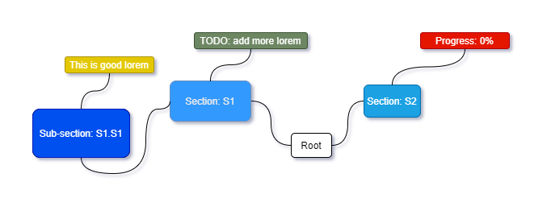
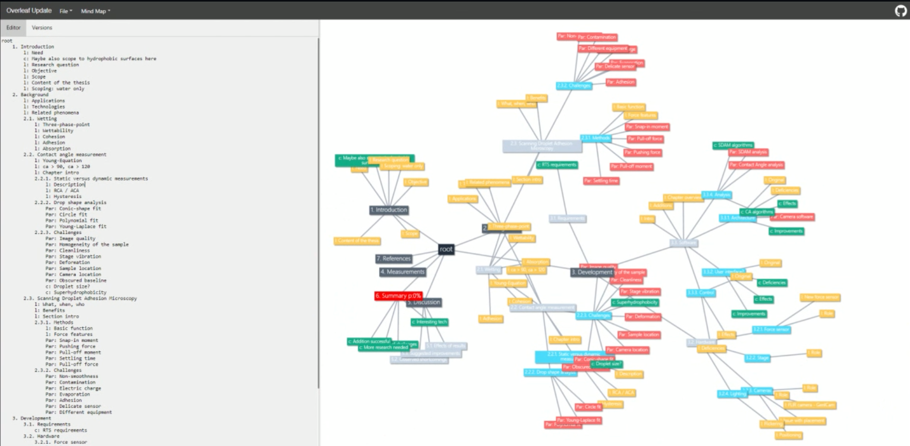
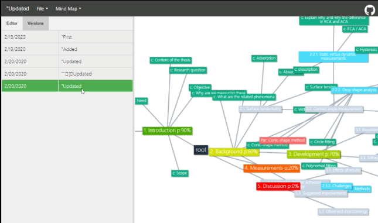

>Writing your thesis. Ah what an arduous task! Like probably many of us, I also encountered a point where comprehending the entire scope of the thesis was overflowing to every umaginable direction. I wanted - no, needed - a way to visualise what I was doing, for example a simple mind map.
>
>However, being as lazy as I am, I did not want to have a mindmap that I had to manually update every time I made changes to the thesis structure. It simply **had** to be automated.


## A map for your thoughts
I started playing around with the excellent [mind-map tool](https://tobloef.com/text2mindmap/) I found online, which allowed creating mind-maps using tabbed text. This was something I could definitely use as a base for my implementation. But I wanted more. I wanted a process fully integrated to my workflow. By bare minimum, I wanted to have a system that would update the mind map every time I updated my thesis. Additionally, having a list of previous versions would be nice as well: one could observe what had been changed over time.


## Seeing the tree from the woods
Information-wise, I naturally wanted to present as much as I could. When parsing the text in my thesis, I might as well analyse some information of it. This process of parsing and information extraction can be seen in more detail at the [pytextree](/projects/pytextree) post. The most prominent information that would be presented is:

  1. Child-parent relations of chapters and sub-chapters as edges
  2. Word count in the sections as the node sizes
  3. References presented as dotted line edges
     - Line colour describing the source
  4. Elements presented as nodes
  	  - Different colours for different types of Elements

```py
<TNode [Root]: Root (0, 5502)>
└── <TEnv [document]>: None (114, 5500)
   ├── <TNode [section]: S1 (144, 1129)>
   │   ├── <TNode [subsection]: S1.S1 (619, 869)>
   │   └── <TNode [subsection]: S1.S2 (870, 1129)>
   ├── <TNode [section]: S2 (1130, 2542)>
   │   └── <TNode [subsection]: S2.S1 (1460, 2542)>
   │       ├── <TEnv [itemize]>: list:mylist (1606, 1867)
   │       │   ├── <TEnv [itemize]>: None (1695, 1771)
   │       │   └── <TEnv [itemize]>: None (1776, 1853)
   │       ├── <TEnv [itemize]>: list:mylist (1869, 1959)
   │       ├── <TEnv [tabular]>: table:synonyms (2032, 2136)
   │       ├── <TNode [subsubsection]: S2.S1.S1 (2140, 2230)>
   │       └── <TNode [subsubsection]: S2.S1.S2 (2231, 2542)>
   ├── <TNode [section]: S3 (2543, 5485)>
   │   ├── <TNode [paragraph]: This is a paragraph (3417, 4368)>
   │   ├── <TNode [paragraph]: And have another paragraph (4369, 5299)>
   │   └── <TNode [subsection]: S3.S1  (5300, 5484)>
   └── <TEnv [appendices]>: None (5435, 5485)
```
*Example tree structure of a document, produced with the pytextree*

Also, as I used comments in the document extensively as a way to structure and draft my writing, I wanted a way to add these to the graph as well. This way I could plan and see what I had planned, but not implemented yet, in my thesis: I planned to use comments prefixed with a special tag to denote special nodes on the graph. For example:

Tag | Meaning | Effect
---    | ------- | ------
`%c:`    | Comment | Special colour
`%l:`    | Label | Special colour
`%par:`  | Paragraph | Special colour
`%p:XX:` | Progress | Colour node based on progress (XX)


Hence, for example the following little snippet would be portrayed as follows:

```tex
\documentclass{article}
\begin{document}
   \section{S1}\label{sec:S1}
   %c: TODO: add more Lorem
   Lorem ipsum dolor sit amet.

   \subsection{S1.S1}\label{sec:S1S1}
   %l: This is good lorem 
   At vero eos et accusamus. Lorem: \ref{sec:S1}.

   \section{S2}
   %p:00

\end{document}
```
*What I had: The original raw LaTeX document with extremely meaningful and original content.*

```
<TNode [Root]: Root (0, 13)>
└── <TEnv [document]>: None (1, 13)
   ├── <TNode [section]: S1 (2, 5)>
   │   ├── <TNode [subsection]: S1.S1 (6, 9)>
   └── <TNode [section]: S2 (10, 13)>
```
*What I got: The document above, parsed using `pytextree`. Each `TNode` would contain the related parsed special comments.*

  
*What I wanted: a sketch of how I wanted the content above to eventually be presented.*

This way, I could manually keep track of my progress already when writing the LaTeX document, and did not have to implement any more complex algorithms to the parser itself. Moreover, the special comments would be nicely searchable within the project and hence provided a systematic way to add more stable and considered comments throughout the text.

---
## Putting it all together
Using by prior knowledge on a couple of projects, I decided to host the parsing service along with the web UI backend as a single Flask app. Some routes would work as an `restAPI` endpoints to parse documents into format which would be ready to visualise using the front-end. Using the version of `text2MindMap` [tobloef](https://github.com/tobloef) had made as a reference, I managed to scurry up a quite logical solution combining my parser, and his mind map visualisation into a one single working webapp.

### Reverse traverse the tree!
For the front-end, I managed to find a non-minimized version of the previously mentioned mind map tool. By staring at the code long enough and poking around it, I managed to reverse engineer its functionality up to the point which allowed me to use it for my own, seemingly nefarious, purposes. Breaking up the gargantuan class into smaller, more logical and easily handleable pieces helped the process - but only up to a certain point.
More about this a bit later... Main thing being that I managed to make the solution work, and was able to make adjustments to it as needed!


*Using the reverse engineered `text2mindmap` code and my own parser, this UI was created with most of the planned functionality included*

### Git gud
I was mainly writing my thesis using Overleaf. Especially with the professional tier features obtained through the university license, I found it extremely useful. Moreover, it had a github integration which I found intriguing. Having messed around with some git hooks on previous projects, I was considering a functionality, which would automatically update the map whenever I would update my thesis: Having a history of what I had done would allow me to check my progress over time.

  
*Chaos documented in history!*

To automate the process, I wrote a small [git-hook](https://www.git-scm.com/docs/githooks#_pre_push) for the `pre-push` action. It would ask the user to input a description of the push in question and then try uploading it to the **mongoDB** on cloud with specific `USER` and `PROJECT` IDs for later retrieval. Not very secure, I admit, but hey, it works for this sort of MVP.

```bash
#!/bin/bash

echo "Preparing to upload latest version to MindMapper"
echo "Please insert update message (within quotes):"

#read MSG
read MSG < /dev/tty


# Uploading setup:
USER_ID=
PROJECT=
PARSER=

# File to parse and upload:
FILE=

# read the selected file contents:
JSON=$(python -c "import json,sys;f=open(sys.argv[1],'r');d=f.read();print(json.dumps({'msg':sys.argv[2],'txt':d}));f.close()" $FILE $MSG)

URL="https://tex-mind-mapper.herokuapp.com//parse/$PARSER/$USER_ID/$PROJECT"
STATUS=$(curl -H 'Content-Type: application/json' -X PUT -d "$JSON" $URL --write-out %{http_code} --output /dev/null --silent)

echo Response: $STATUS

# If the script runs successfully, allow push
if [ $STATUS -eq 202 ]; then
    echo "UPLOAD OK"
    exit 0
else
    # Otherwise raise
    echo "UPLOAD FAILED"
    exit 1
fi
```
*The code for **git push hook** used to automate uploading a version of the LaTeX document as a mind map to a **mongoDB** database*


### Too much features, too little functionality
However - a relatively big however actually - the code was absolutely abysmal. Making even smallest changes to it required always checking the existing code for something that would brake; I had to constantly remove things that I hope I did not need (which sometimes felt like pulling the cork from a rowing boat in full, blissful ignorance of its role) and most of the time, things ended up working, eventually, with me having no idea why. 

- animations, styles, usability
- a few features, properly!
- Noticing that the version was not that useful (as no comparison on two)
- 
### `tl:dr` 
- me lazy
- no want upkeep code I did not write
-  plenty of bugs and hot-fixes with chewing gum 

---> start from scratch.

## Fresh start
- vis.js
- ddd js
- animations, styles, usability
- a few features, properly!
- Noticing that the version was not that useful (as no comparison on two)

So, once again I was at the drawing board, but now with much more experience and clear needs. The backend of my little app (parsing, serving) I already was quite satisfied with, or I could easily just copy&paste the parts I needed, so what I essentially was missing, was the UI part.

To reduce the effort of developing far too many features at the same time, without a proper plan of how to make them properly work with each other, I decided to got with the plan, which, in hindsight, would had been best to adapt straight from the beginning: start with the bare minimum and build from there. Oh how greed sometimes takes the hold of you when you get excited!

For the UI, I needed (at bare minimum, remember) a library to visualise a mind-map, i.e. a graph. I found two considerable options for this: ddd.js and vis.js. After reading some reviews and tutorials on both, I felt that the vis.js was more suitable for my needs: less hassle, no extra data structures needed and nice, editable layout. Moreover, the maps had some organising physics already built in (by far more smart people than me) which would hopefully allow me to make my graphs nice and tidy to look at. Hopefully.


  
*My thesis!*


## Shiny!
